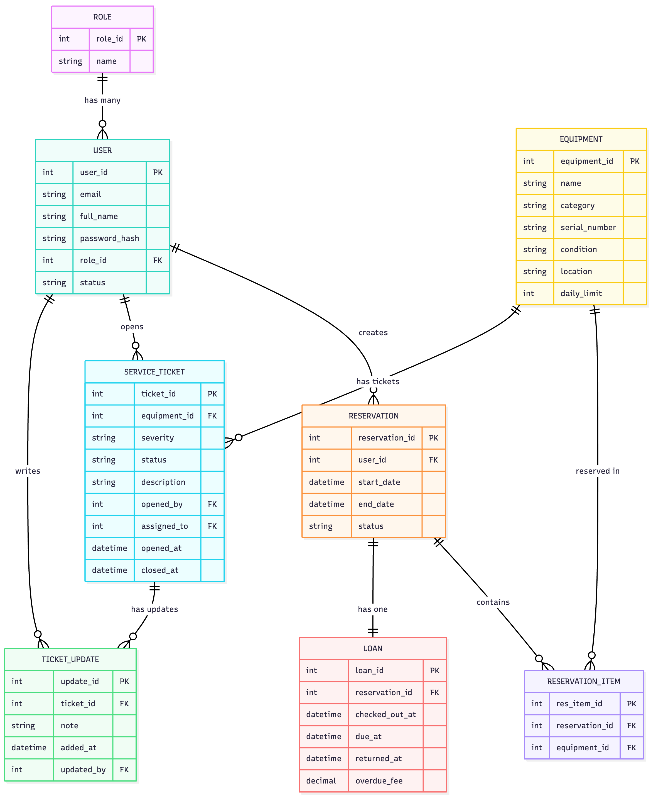
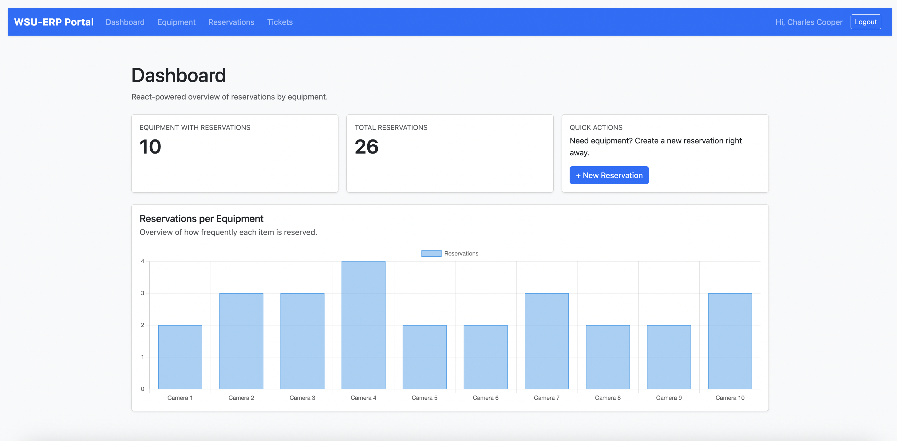
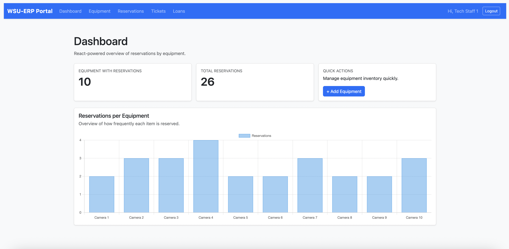
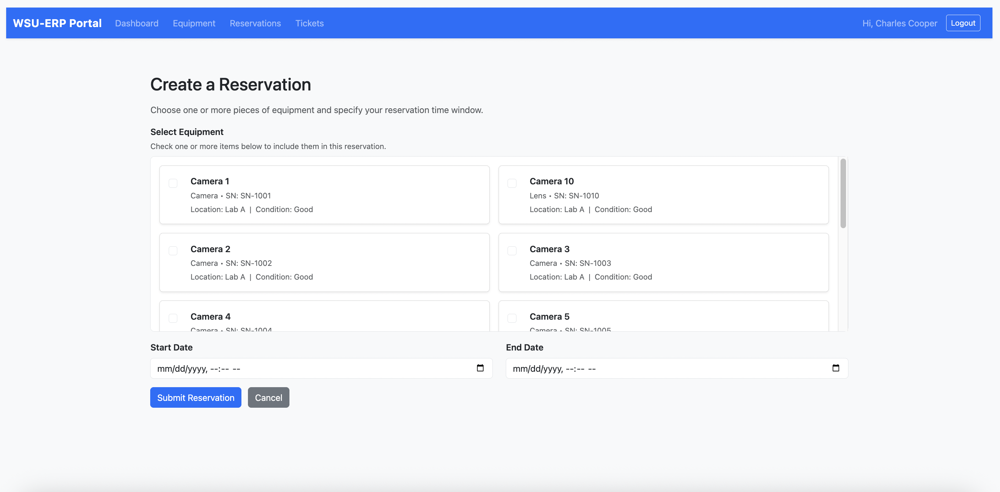
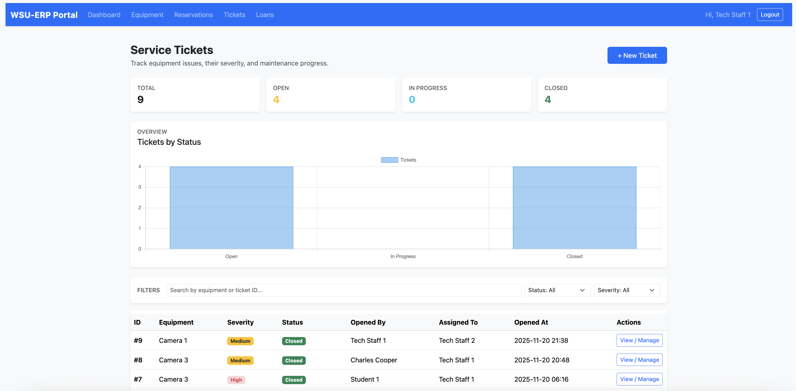

# 📚 WSU ERP System — Equipment Reservation & Maintenance Portal  


A full-stack web application designed for **equipment reservations, service ticket tracking, and loan management** at Wichita State University.  
Provides **role-based access** for Students and Tech Staff with a modern UI + embedded React dashboard.

---

## 🖼️ Screenshots

### 🔹 Database Architecture  


### 🔹 Student Dashboard  


### 🔹 Tech Staff Dashboard  


### 🔹 Reservation Form  


### 🔹 Service Tickets  


---

## 🚀 Features

### 👥 User Roles

#### **Student**
- Reserve equipment  
- Submit service tickets  
- Track ticket status  
- Check reservation history  

#### **Tech Staff / Admin**
- Approve/Deny reservations  
- Create loans & mark returns  
- Auto-calculate overdue fees  
- Manage equipment inventory  
- Assign service tickets to staff  
- Track maintenance progress  
- View analytics dashboard  

---

## 🛠 Tech Stack

### Backend  
- Python 3  
- Flask + Jinja2  
- SQLAlchemy ORM  
- SQLite  

### Frontend  
- React (embedded components)  
- Chart.js analytics  
- Bootstrap 5  

### Tools  
- Git / GitHub  
- VS Code  
- Flask-Login  

---

## 🧱 System Architecture

```
WSU_ERP_System/
│── app.py                # Main Flask app
│── models.py             # SQLAlchemy models
│── seed.py               # DB seeding script
│── requirements.txt
│
├── templates/            # Jinja2 + React-embedded templates
│   ├── base.html
│   ├── dashboard.html
│   ├── reservations_list.html
│   ├── ...
│
├── static/
│   ├── main.css
│   ├── react/            # React bundles (future)
│
├── instance/
│── README.md
```

---

## 🔧 Installation

### 1. Clone repository
```bash
git clone https://github.com/dheeraj2804/wsu_erp_system.git
cd wsu_erp_system
```

### 2. Create virtual environment
```bash
python3 -m venv venv
source venv/bin/activate
```

### 3. Install dependencies
```bash
pip install -r requirements.txt
```

### 4. Initialize database
```bash
flask init-db
```

### 5. Seed the DB
```bash
python seed.py
```

### 6. Start the server
```bash
python app.py
```

Visit: **http://127.0.0.1:5000**

---

## 🔐 Default Login Accounts

### Student
- **Email:** `student1@example.com`  
- **Password:** `123456`

### Tech Staff
- **Email:** `staff1@example.com`  
- **Password:** `123456`

---

## 📈 Analytics Dashboard

Powered by **React + Chart.js**  
Displays:
- Reservations per equipment  
- Reservation trends  
- Usage statistics  

---

## 📌 Future Enhancements
- Full React single-page front-end  
- Email notifications for approvals, overdue loans  
- User profile management  
- Equipment availability calendar view  
- Docker deployment support  

---

## 🤝 Contributing
1. Fork the repo  
2. Create a feature branch  
3. Commit changes  
4. Push to your fork  
5. Open a pull request  

---

## 📄 License
This project is for **educational purposes**.
